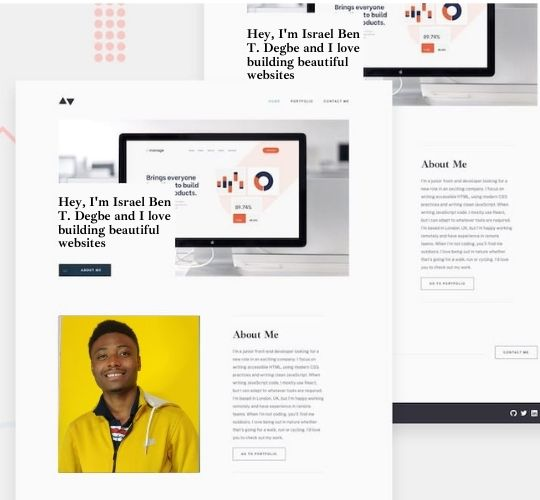

# Minimalist Portfolio

This project is a multi-page portfolio site. The website showcases my skills and works. I took the time to represent some major projects I have done in order to give an estimation of my capabilities.

## Table of contents

- [Overview](#overview)
  - [Screenshot](#screenshot)
  - [Links](#links)
- [My process](#my-process)
  - [Built with](#built-with)
- [Author](#author)

**Note: Delete this note and update the table of contents based on what sections you keep.**

## Overview

### Screenshot

### Links

- Live Site URL: click [here](https://israel-beni.github.io/minimalist-portfolio/) to see the code in action.

## My process

- The UI design used, was provided by [Frontend Mentor](https://www.frontendmentor.io/).
- For the url routing, I used React Router
- I built the app using the component concept of React.js

### Built with

- [React](https://reactjs.org/) - JS library
- React Router
- CSS custom properties
- Semantic HTML5 markup
- Mobile-first workflow
- CSS3 - For styles

## Author

- Website - [@IsraelBeni](https://israel-beni.github.io/minimalist-portfolio/)
- Frontend Mentor - [@Israelbeni](https://www.frontendmentor.io/profile/yourusername)
